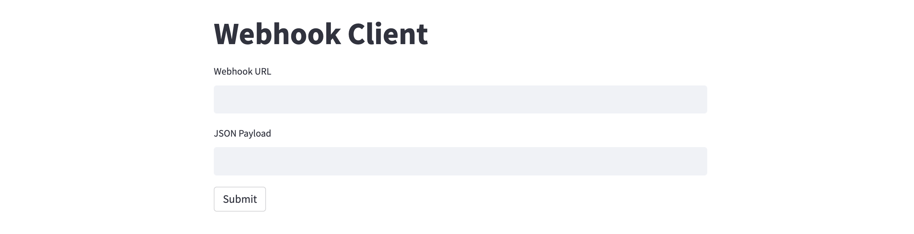

# webhook-client-streamlit
A sample webhook client application using Streamlit. The client takes `Webhook URL` and `JSON Payload` as inputs, and makes an HTTP POST request to the specified webhook endpoint URL along with the payload. 

For a detailed guide to webhook clients, see [this](https://alphasec.io/getting-started-with-webhooks-part-2-webhook-clients/) post. To deploy on [Railway](https://railway.app/?referralCode=alphasec) using a one-click template, click the button below.

